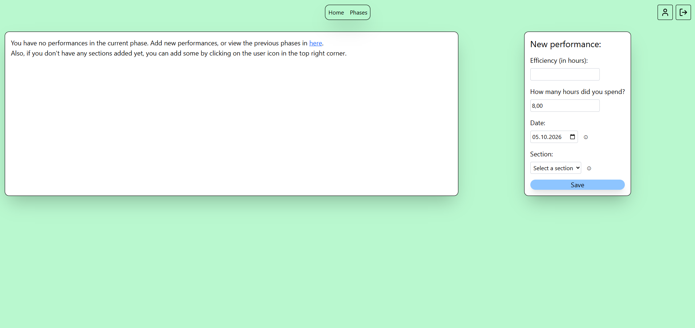
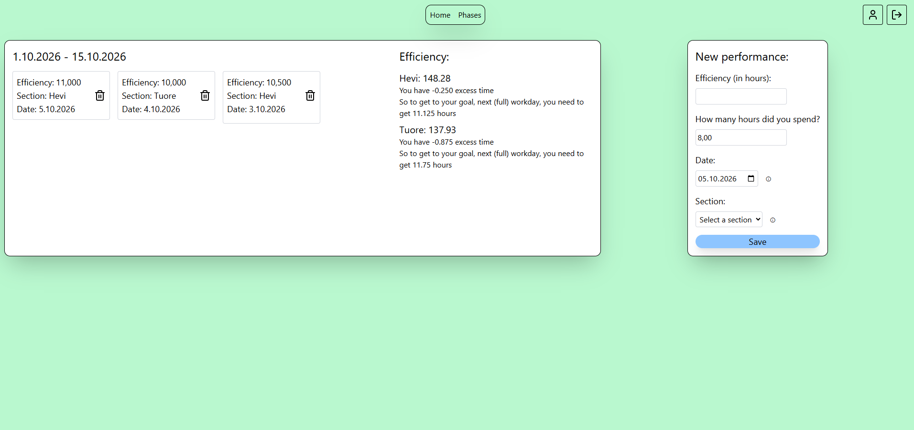
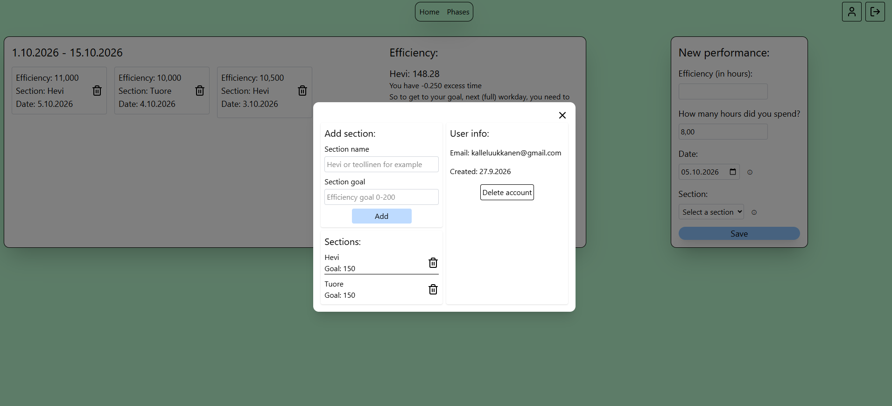
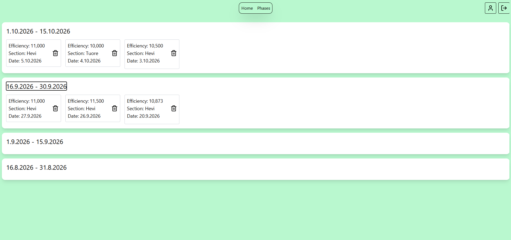

This performance tracker is meant for warehouse workers, who get their work performance tracked using the hour system. The user can add work sections and goals for each, then use the tracker to make sure you reach these goals. Simply, after each work day, you add the efficiency of that day, then it calculates how much time you need or how much excess time you have to reach your goal.
Some screenshots:

Built with React, Express, Node.js, TypeScript, PostgreSQL, TailwindCSS and BetterAuth.